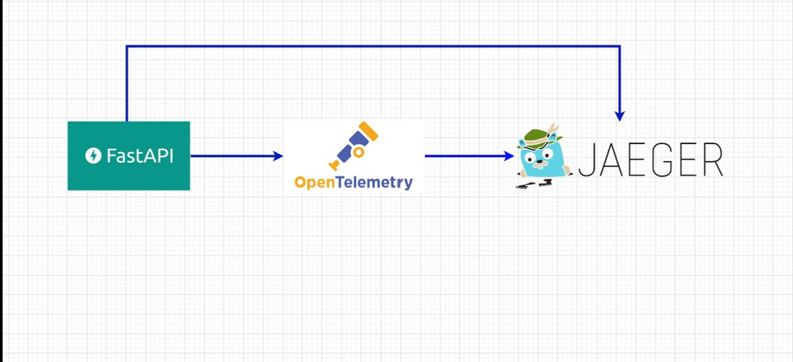

# FastAPI con OpenTelemetry y Jaeger



Este proyecto es una prueba de como se puede integrar OpenTelemetry y Jaeger en una aplicación FastAPI.

## Prerequisitos

- Docker
- Docker Compose (para ejecutar jaeger)
- Python (para ejecutar la API)
- virtualenv o venv (para crear el entorno virtual)

## Ejecutar jaeger con docker-compose

```
docker-compose up jaeger
```

## Crear el entorno virtual

Para instalar las dependencias necesarias, se debe crear un entorno virtual con python.

* A continuación se muestra como hacerlo con venv

```
python -m venv nombre_del_entorno
```

* Una alternativa a venv es virtualenv, a continuacion se muestra como hacerlo con virtualenv 
con una python 3.11

```
virtualenv nombre_del_entorno -p=3.11
```

## Activar el entorno virtual

Para activar el entorno virtual, desde tu consola en linux o mac, ejecuta el siguiente comando:

```
source nombre_del_entorno/bin/activate
```

## Instalar las dependencias

Para instalar las dependencias necesarias, se debe ejecutar el siguiente comando:

```
pip install -r requirements_with_versions.txt
```


## Diferentes formas de ejecutar el proyecto

### Ejecutar el proyecto desde consola:

Para ejecutar el proyecto, se debe ejecutar el siguiente comando:

```
uvicorn main:app --port 9000 --reload
```

### Ejecutar el proyecto desde docker-compose:

Para ejecutar el proyecto, se debe ejecutar el siguiente comando:

```
docker-compose up troni-api
```

### Ejecutar el proyecto con vscode debugger

Debes tener vscode instalado y el debugger de python instalado.

En la pestaña de la izquierda, en la sección de "Debug", haz click en el icono de "Run and Debug" y selecciona "Python Debugger: FastAPI" esta configuración esta en el archivo .vscode/launch.json


## Probar que funciona

Para probar el funcionamiento de la integracion, deberas hacer peticiones a la API, a continuacion te muestro diferentes formas de hacerlo.

### Petición a la API

Con ayuda de curl, puedes hacer peticiones a la API desde la consola, por ejemplo:

```
curl http://localhost:9000/health
```

Si no tienes curl instalado, puedes simplemente visitar la siguiente url en tu navegador:

```
http://localhost:9000/health
```

Si prefieres hacer las peticiones de una forma mas visual, puedes visitar la siguiente la docs que genera fastapi en ´http://localhost:9000/docs´  y desde la documentación que se muestra con swagger puedes probar los endpoints de la API


### Ver los datos en jaeger

Ya que hiciste diversas peticiones a la API, deberias ver los datos en jaeger, para ello, puedes visitar la siguiente url:

```
http://localhost:16686/
```

